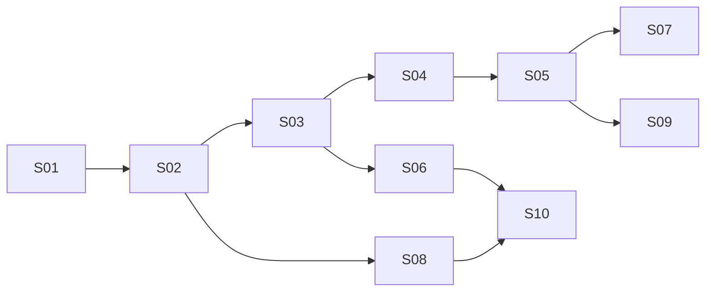
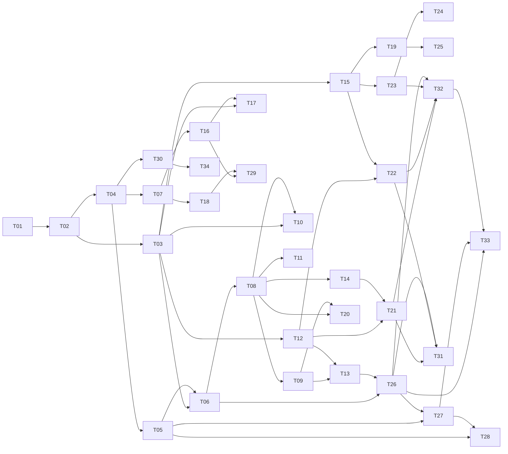

# 主题全集与执行计划：BullMQ

> 覆盖范围：概念模型 / 核心机制 / API 或操作面 / 典型场景 / 工程集成 / 性能容量 / 可靠性 / 排错可观测 / 安全 / 测试验证 / 版本演进 / 常见坑。
> 版本基线：**BullMQ v6**（最新 6.3.9，2026-09-25 发布；v6.0.0 于 2026-07-30 发布）。
> 事实来源：docs.bullmq.io 官方文档导航 + v5→v6 迁移页 + PostgreSQL 后端页 + npm registry 元数据，抓取日期 2026-09-28。
>
> **两层结构**：第一节是**当前执行计划**（20 小时冲刺，S01–S10）；第二节是**完整知识地图**（T01–T34），用于以后扩展成系统计划。

## 一、当前执行计划：20 小时冲刺（S01–S10）

目标：**两周内达到「能上手写 + 面试能答」**。总投入 ≈ 20.1 h（含 35% 复习，技能规定的复习下限）。学时 = 冲刺深度下的学习块时长。

| ID | 单元 | 阶段 | 难度 | 重要性 | 类型 | 前置 | 学时 | 含复习(×1.35) | 累计 | 吸收的完整地图主题 | 验收方式 |
| --- | --- | --- | --- | --- | --- | --- | --- | --- | --- | --- | --- |
| S01 | 概念模型与选型：四个核心类、Job 生命周期全景、与其它中间件的差异 | 阶段1·主干 | L1 | 核心必学 | 概念 | - | 0.5 | 0.7 | 0.7 | T01, T02 | 口述 Queue/Worker/QueueEvents/FlowProducer 的职责，并说明 BullMQ 与 Kafka/SQS 的选型差异 |
| S02 | 最小闭环与 Job 数据模型：Queue.add、processor、jobId/data/opts、返回值 | 阶段1·主干 | L2 | 核心必学 | API 用法 | S01 | 1.5 | 2.2 | 2.9 | T04, T07 | 本地跑通生产+消费，并说出常用 opts 各自影响的行为 |
| S03 | Job 状态机与迁移路径（wait/delayed/prioritized/active/completed/failed/waiting-children） | 阶段1·主干 | L2 | 核心必学 | 原理机制 | S02 | 1.0 | 1.5 | 4.4 | T03 | 写出 add→active→completed 与失败重试两条完整迁移序列 |
| S04 | Worker 机制与存储布局：拉取循环、并发模型、锁续约、stalled job、Redis key 结构 | 阶段1·主干 | L3 | 核心必学 | 原理机制 | S03 | 2.0 | 3.4 | 7.8 | T06, T08, T09, T14 | 用 redis-cli 指认 job 在 wait/active 时的 key，解释如何避免重复消费，给出 stalled 成因清单，并为给定吞吐算出并发配置 |
| S05 | 失败语义、重试与幂等：attempts/backoff、UnrecoverableError、至少一次投递 | 阶段1·主干 | L3 | 核心必学 | 工程实践 | S04 | 2.0 | 3.4 | 11.2 | T12, T21 | 写出三档指数退避，并说明扣款类任务的幂等方案与重放后果 |
| S06 | 延迟、调度与优先级：delayed、Job Scheduler（cron/时区）、priority 与 FIFO/LIFO | 阶段2·扩展 | L3 | 核心必学 | API 用法 | S03 | 1.5 | 2.5 | 13.7 | T10, T16, T11 | 配置带时区的 cron 调度器并预测优先级与 FIFO/LIFO 下的处理顺序 |
| S07 | 限流与背压：queue limiter、worker limiter、global rate limit | 阶段2·扩展 | L3 | 推荐 | 工程实践 | S05 | 0.5 | 0.8 | 14.5 | T13 | 为下游 10 rps 的 API 设计限流方案并说明放在哪一层（时间紧时可砍） |
| S08 | 连接、优雅关闭与运维操作：ioredis 约束、SIGTERM 关停、pause/drain/obliterate | 阶段2·扩展 | L2 | 核心必学 | 工程实践 | S02 | 1.5 | 2.2 | 16.7 | T05, T20, T19 | 写出 worker/QueueEvents 的正确连接配置，并实现不丢任务的关停流程 |
| S09 | 事件、可观测性与排错：worker 事件 vs QueueEvents、指标、常见坑 | 阶段3·收口 | L3 | 核心必学 | 运维排错 | S05 | 1.0 | 1.7 | 18.4 | T15, T23（精简）, T31 | 说出任务积压该看哪些指标，并指出给定反例代码的问题 |
| S10 | 版本演进与综合演练：v5→v6 破坏性变更、面试问答清单、小项目串讲 | 阶段3·收口 | L3 | 核心必学 | 概念 | S06,S08 | 1.0 | 1.7 | 20.1 | T29, T32（精简） | 产出 v5→v6 升级检查清单，并独立讲清一个带重试/幂等的队列服务设计 |

> 上表的「验收方式」列是给人读的版本；`state.json` 里每条主题的 `verify` 字段会多一个 `覆盖 Txx+Tyy｜` 前缀，用于机器追踪该单元吸收了完整地图里的哪些主题。结构字段（标题/阶段/难度/重要性/类型/前置/学时）两处必须完全一致。

阶段与节奏：

| 阶段 | 单元 | 含复习累计 | 两周节奏 |
| --- | --- | --- | --- |
| 阶段1·主干 | S01–S05 | 11.2 h | 第 1 周完成（7 h 略紧，可顺延到第 8 天） |
| 阶段2·扩展 | S06–S08 | 16.7 h | 第 2 周前半 |
| 阶段3·收口 | S09–S10 | 20.1 h | 第 2 周后半 |

降级规则（自动执行，不静默延后）：第 7 天（2026-10-05）检查点，若 S01–S05 未完成，则本计划降级为 **14 h 保底版**——只做 S01–S06，把 S07 砍掉、S08/S09/S10 转为「面试前速读清单」（每项 15–20 分钟速读 + 一道自测题）。

## 二、完整知识地图（T01–T34，非当前执行计划）

> 「本轮」列 = 是否被冲刺单元吸收（✅ 已吸收 / 速读 / — 本轮不做）。
> 这张地图对应「系统掌握 + 工程落地」口径（≈ 112 h）。要切换到完整计划：先备份，再用 `new-workspace --force` 重建后运行 `scripts/register-full-topics.sh`（不要与 S 单元混在同一个 state 里）。

| 本轮 | ID | 主题 | 阶段 | 难度 | 重要性 | 类型 | 前置依赖 | 学时 | 遗忘速度 | 验收方式 |
| --- | --- | --- | --- | --- | --- | --- | --- | --- | --- | --- |
| ✅ S01 | T01 | BullMQ 定位与选型：四个核心类、与 Bull/Kafka/SQS/Celery 的差异 | 阶段1·地基 | L1 | 核心必学 | 概念 | - | 1.0 | 慢 | 口述 BullMQ 与消息中间件的差异，并说明什么场景不该用它 |
| ✅ S01 | T02 | 核心类与术语：Queue / Worker / QueueEvents / FlowProducer / Job / JobScheduler | 阶段1·地基 | L1 | 核心必学 | 概念 | T01 | 1.0 | 慢 | 画出四类对象的职责与调用关系 |
| ✅ S03 | T03 | Job 生命周期与状态机（wait/prioritized/delayed/active/completed/failed/waiting-children） | 阶段1·地基 | L2 | 核心必学 | 原理机制 | T02 | 1.5 | 中 | 写出任意一条 add→处理→完成 的完整状态迁移序列 |
| ✅ S02 | T04 | 最小可运行闭环：Queue.add + Worker 处理 + 结果返回 | 阶段1·地基 | L1 | 核心必学 | API 用法 | T02 | 1.5 | 中 | 本地跑通生产者+消费者，job 被正确处理并拿到返回值 |
| ✅ S08 | T05 | 连接与配置：ioredis 选项、worker 阻塞连接约束、连接复用 | 阶段1·地基 | L2 | 核心必学 | 工程实践 | T04 | 2.0 | 快 | 解释为何 worker/QueueEvents 需要 maxRetriesPerRequest=null 并写出配置 |
| ✅ S04 | T06 | 存储布局与原子性：Redis key 结构 + Lua 脚本 | 阶段2·核心机制 | L3 | 核心必学 | 原理机制 | T03,T05 | 2.0 | 中 | 用 redis-cli 观察一个 job 从 wait→active→completed 的 key 变化 |
| ✅ S02 | T07 | Job 数据模型与 options 全解（jobId、data、opts、返回值与进度） | 阶段2·核心机制 | L2 | 核心必学 | API 用法 | T04 | 2.0 | 快 | 列出常用 opts 并说出各自影响的行为 |
| ✅ S04 | T08 | Worker 拉取循环与并发模型（阻塞读取、active 集合、token） | 阶段2·核心机制 | L3 | 核心必学 | 原理机制 | T06 | 2.0 | 中 | 解释 worker 如何避免空转与重复消费 |
| ✅ S04 | T09 | 并发与横向扩展：本地 concurrency、global concurrency、多进程与多机 | 阶段2·核心机制 | L3 | 核心必学 | 工程实践 | T08 | 2.0 | 中 | 为给定吞吐目标算出 worker 数与并发配置并说明假设 |
| ✅ S06 | T10 | 延迟任务：delayed 集合与到期提升机制 | 阶段2·核心机制 | L3 | 核心必学 | 原理机制 | T03,T08 | 1.5 | 中 | 说明 delay 的实现方式与精度限制 |
| ✅ S06 | T11 | 优先级与 FIFO/LIFO 语义 | 阶段2·核心机制 | L3 | 推荐 | 原理机制 | T08 | 1.5 | 中 | 构造优先级与 FIFO/LIFO 组合并预测处理顺序 |
| ✅ S05 | T12 | 失败与重试：attempts、backoff（fixed/exponential/custom）、UnrecoverableError | 阶段2·核心机制 | L2 | 核心必学 | 原理机制 | T03 | 2.0 | 中 | 写出三档指数退避策略并解释每次重试的调度 |
| ✅ S07 | T13 | 限流：queue limiter、worker limiter、global rate limit | 阶段2·核心机制 | L3 | 推荐 | 工程实践 | T09,T12 | 2.0 | 快 | 为下游 10 rps 的 API 设计限流方案并说明放在哪一层 |
| ✅ S04 | T14 | Stalled job：锁续约、lockDuration、maxStalledCount 与排查路径 | 阶段2·核心机制 | L4 | 核心必学 | 原理机制 | T08 | 2.5 | 中 | 给出 stalled 的成因清单与定位命令 |
| ✅ S09 | T15 | 事件系统：Worker 本地事件 vs QueueEvents（streams）与自定义事件 | 阶段2·核心机制 | L2 | 核心必学 | API 用法 | T03 | 2.0 | 快 | 用 QueueEvents 监听完成/失败并说明与 worker 本地事件的区别 |
| ✅ S06 | T16 | Job Scheduler：cron/间隔、时区、模板 job、limit 与起止时间 | 阶段2·核心机制 | L3 | 核心必学 | API 用法 | T07 | 2.5 | 中 | 配置带时区的 cron 调度器并验证下一次执行时间 |
| 速读 | T17 | Flows：父子依赖、waiting-children、fail/continue parent、移除依赖 | 阶段2·核心机制 | L3 | 推荐 | API 用法 | T03,T16 | 2.5 | 中 | 构建三层 flow 并验证父任务在子任务完成后才执行 |
| 速读 | T18 | 去重（deduplication id/ttl/replace/extend）与 v6 移除 debounce | 阶段2·核心机制 | L3 | 推荐 | API 用法 | T07 | 1.5 | 快 | 用 dedup id 实现同一订单只入队一次 |
| ✅ S08 | T19 | 队列运维操作：pause/resume、drain、obliterate、clean、自动清理 | 阶段2·核心机制 | L2 | 推荐 | 运维排错 | T15 | 1.5 | 快 | 在不停服前提下暂停并清空一个测试队列 |
| ✅ S08 | T20 | 优雅关闭、任务取消与沙箱处理器 | 阶段2·核心机制 | L3 | 核心必学 | 工程实践 | T08,T09 | 2.5 | 中 | 实现 SIGTERM 下不丢任务、不硬中断执行中任务的关闭流程 |
| ✅ S05 | T21 | 至少一次投递与幂等设计 | 阶段3·工程实践 | L3 | 核心必学 | 工程实践 | T12,T14 | 2.0 | 慢 | 为扣款类任务写出幂等方案并说明重放后果 |
| 速读 | T22 | 失败处理策略：停止重试、死信、人工重放与告警 | 阶段3·工程实践 | L3 | 核心必学 | 工程实践 | T12,T15 | 2.0 | 中 | 设计一套失败任务处置流程（含人工介入） |
| ✅ S09 | T23 | 可观测性：metrics、Prometheus 指标、日志与队列看板 | 阶段3·工程实践 | L3 | 推荐 | 运维排错 | T15 | 2.0 | 中 | 说清任务积压该看哪些指标 |
| — | T24 | 官方 Telemetry：OpenTelemetry traces/metrics 接入 | 阶段3·工程实践 | L3 | 推荐 | 生态集成 | T23 | 2.0 | 中 | 接入 telemetry 并在 Jaeger 看到 job 的 trace |
| — | T25 | 测试策略：隔离前缀、obliterate、时间相关逻辑与集成测试 | 阶段3·工程实践 | L3 | 推荐 | 工程实践 | T19 | 2.0 | 中 | 写出一组互不干扰的队列集成测试 |
| — | T26 | 性能与容量：批量添加、序列化、Redis 负载与保留策略 | 阶段3·工程实践 | L4 | 推荐 | 性能调优 | T06,T13 | 2.5 | 中 | 估算目标吞吐对应的 Redis 资源与保留配置 |
| — | T27 | Redis 部署形态：单机/哨兵/集群（hash tag）、托管服务与兼容性 | 阶段4·生产与演进 | L4 | 推荐 | 运维排错 | T05,T26 | 2.0 | 慢 | 说明集群模式下必须遵守的前缀/hash tag 约束 |
| 速读 | T28 | 后端选择：v6 的 PostgreSQL 后端 vs Redis 后端 | 阶段4·生产与演进 | L3 | 推荐 | 概念 | T05,T27 | 1.5 | 慢 | 说出两套后端的取舍与迁移代价 |
| ✅ S10 | T29 | 版本演进与迁移：repeatable→Job Scheduler、v5→v6 破坏性变更 | 阶段4·生产与演进 | L3 | 核心必学 | 概念 | T16,T18 | 2.0 | 中 | 产出一份 v5→v6 升级检查清单 |
| — | T30 | 生态与多语言：NestJS 集成、多语言绑定互操作、看板工具 | 阶段4·生产与演进 | L2 | 选修 | 生态集成 | T04 | 1.5 | 慢 | 用 NestJS 跑通一个最小队列 |
| ✅ S09 | T31 | 常见坑与反模式清单 | 阶段4·生产与演进 | L3 | 核心必学 | 运维排错 | T21,T22,T26 | 1.5 | 中 | 对给定反例代码指出问题并给出改法 |
| ✅ S10 | T32 | 综合项目：带重试/限流/幂等/可观测性的队列服务 | 阶段5·综合与巩固 | L4 | 核心必学 | 工程实践 | T21,T22,T23,T26 | 4.0 | 慢 | 交付可运行项目 + 设计说明并接受评审提问 |
| — | T33 | 故障演练：kill worker、Redis 重启与切换、网络抖动 | 阶段5·综合与巩固 | L4 | 推荐 | 运维排错 | T26,T27,T32 | 3.0 | 中 | 记录每类故障的现象、恢复行为与数据影响 |
| — | T34 | BullMQ Pro 概览：groups / batches / observables | 阶段5·综合与巩固 | L2 | 按需查阅 | 生态集成 | T30 | 1.0 | 慢 | 说明 Pro 特性在什么条件下值得付费 |

## 三、依赖关系（冲刺版）

推荐顺序即 S01 → S10 的编号序（S07 视时间可砍；S09/S10 可在第 2 周末压缩）。完整地图的依赖图与顺序见文末附录。

## 四、估算口径

| 口径 | 主题/单元数 | 原始学时 | 难度加权（L1×1.0 / L2×1.1 / L3×1.25 / L4×1.45） | 含复习（35%–50%） |
| --- | --- | --- | --- | --- |
| **冲刺版（当前计划）** | 10 | 12.5 h | 14.9 h | **20.1 h（按 35% 复习下限）** |
| 完整地图「核心必学」 | 20 | 39.5 h | 48.4 h | ≈ 68 h |
| 完整地图「核心 + 推荐」 | 32 | 63.5 h | 79.7 h | ≈ 112 h |

冲刺版课时换算：2 周 × 7 h/周 = 14 h → 覆盖到 S06（累计 13.7 h），即**保底版**；2 周 × 10 h/周 = 20 h → 覆盖 S01–S10；3 周 × 7 h/周 = 21 h → 覆盖 S01–S10（标准版）。

## 五、不确定项（未核实 / 待用户确认）

| 事项 | 为什么不确定 | 怎么确认 | 状态 |
| --- | --- | --- | --- |
| v6 完整变更清单 | 只读了官方 v5→v6 迁移页与 npm 元数据，未逐条读 changelog-v6 与 API Reference | 学 S10 时抓 `/changelogs/changelog-v6` 与 API Reference 核对 | 未核实 |
| `removeOnComplete` / `removeOnFail` 默认保留策略 | 该默认值在多个大版本间调整过，凭记忆易错 | 学 S08 时读 `guide/queues/auto-removal-of-jobs` | 未核实 |
| worker limiter / global rate limit 的引入版本与语义边界 | v5 期间仍在迭代 | 学 S07 时读 `guide/rate-limiting`、`guide/queues/global-rate-limit` | 未核实 |
| Redis 最低版本要求与 v6 是否变化 | 未读官方要求页 | 学 S02/S08 时读 `guide/connections` | 未核实 |
| v6 PostgreSQL 后端在生产环境的成熟度 | 官方定位为可选后端，称 Redis 仍是最经考验 | 读 `guide/postgresql` 全文 | 部分核实 |
| 用户背景（Node/TS、Redis、既有队列经验） | 尚未摸底 | 本轮摸底自评 | 待用户确认 |
| 面试岗位侧重（是否需要 flows / 集群 / 多语言） | 用户未说明岗位方向 | 摸底时确认；若需要 flows 或集群，需追加 2–4 h | 待用户确认 |

## 六、范围外（本轮不做，以及为什么）

| 主题 | 原因 | 面试前兜底动作 |
| --- | --- | --- |
| T17 Flows、T18 去重 | 面试中频；20 h 内优先保住主干，生产上可用简单依赖或业务层去重替代 | 各 20 分钟速读官方页 + 一道自测题 |
| T22 死信与人工重放 | S05 只覆盖语义边界，完整处置流程（告警、重放工具）超出本轮 | 速读 `patterns/stop-retrying-jobs` |
| T24 官方 Telemetry、T25 测试策略 | 需要额外基建投入（OTel collector / 测试容器） | 速读官方 telemetry 与 testing 相关页 |
| T26 性能调优、T27 Redis 集群、T33 故障演练 | L4 深度内容，冲刺版只到「知道该看哪些指标」 | 若生产使用 Redis Cluster，**必须**补 T27（hash tag 是硬约束） |
| T28 PostgreSQL 后端 | v6 新特性，加分项而非必答项 | 速读官方页，能答「有这条路线、取舍是什么」 |
| T30 NestJS / 多语言、T34 Pro | 与当前目标（生产落地 + 面试）无关 | 按需查阅 |

## 附录：完整地图依赖图

完整地图推荐顺序：主干 T01 → T02 → T03 → T04 → T05 → T06 → T07 → T08 → T09 → T10 → T12 → T15 → T16 → T20；穿插 T11、T13、T17、T18、T19；可靠性段 T14 → T21 → T22 → T23 → T24 → T25 → T26；生产段 T27 → T28 → T29 → T31；收口 T32 → T33；选修 T30、T34。
